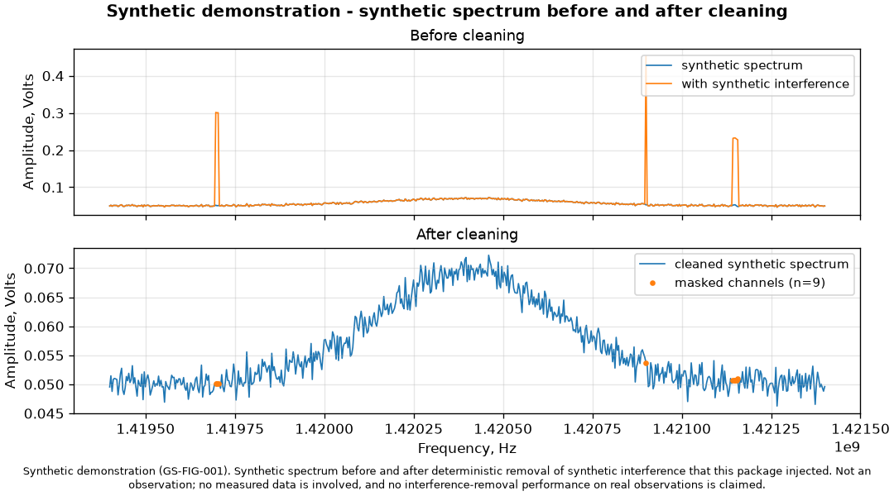
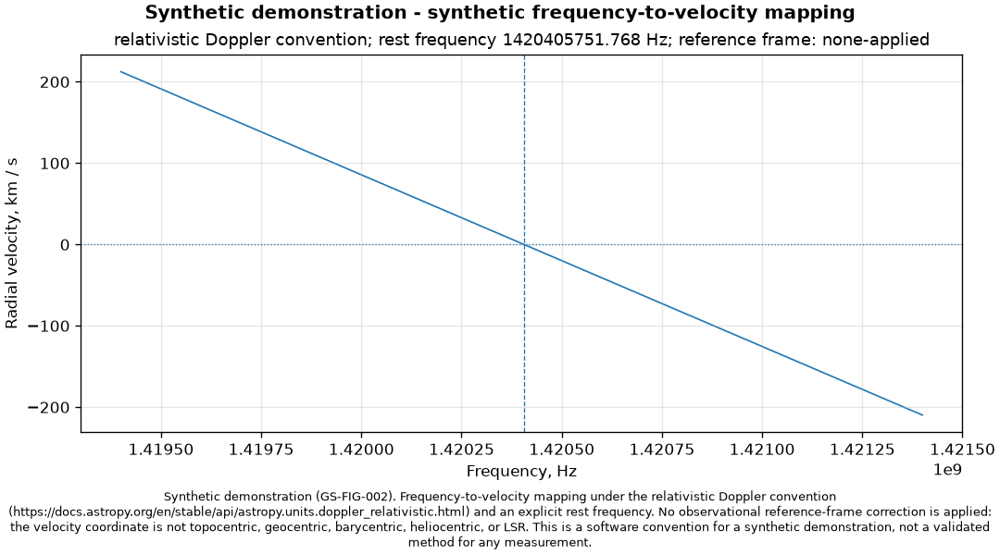

# galaxy-structure

A deterministic, **synthetic-only** demonstration of the software a 21 cm
spectrum analysis needs: schema-validated ingestion, unit-explicit
frequency-to-velocity conversion, deterministic interference injection and
masking, reproducible figures, and a run manifest that records exactly what was
produced.

> **Everything in this repository is synthetic.**
> There is no measured observation here. Nothing produced by this package is an
> observation, and this project makes **no rotation-curve, galactic-structure,
> calibration-accuracy, uncertainty, or detection claim**. See
> [`docs/limitations.md`](docs/limitations.md) — the absence of a scientific
> result is documented, not hidden.

Every material claim below carries an ID registered in
[`docs/claim-evidence.md`](docs/claim-evidence.md).

## What this is

This repository is the software half of a physics final project, rebuilt from
scratch as a tested package. The original project's purpose — analysing
measurements near the 21 cm spectral line to study galactic structure and
rotation curves — is recorded here as the owner's stated **intent**
(`GS-PURPOSE-001`), not as an achieved outcome.

The measured files that project collected are **not** included. Dennis states
that permission covers their public redistribution (`GS-DATA-001`), but the
grantor and documentary source were never supplied, so this implementation
withholds all of them and demonstrates the software on synthetic data instead.

What that leaves is worth reading on its own terms: a pipeline where every unit
is declared, every validation is enforced rather than assumed, every stage that
lacks evidence fails closed instead of returning a plausible number, and every
artifact is byte-reproducible within a pinned environment.

## Install and run

Python 3.12. From a fresh virtual environment:

```bash
python -m pip install --constraint constraints-ci.txt build ruff pytest
python -m pip install --constraint constraints-ci.txt -e .
galaxy-structure run-demo --output-dir output/demo --seed 20260807
```

The demo writes seven artifacts plus a manifest:

| Artifact | Contents |
| --- | --- |
| `synthetic_spectrum.dat` | Synthetic spectrum, two columns, unit-labelled header, strictly increasing uniform frequency grid |
| `synthetic_spectrum_with_interference.dat` | The same spectrum with deterministic synthetic narrow-band interference |
| `synthetic_spectrum_cleaned.dat` | The spectrum after deterministic masking |
| `synthetic_interference_mask.csv` | Every channel the cleaner altered, with its original and replacement value |
| `synthetic_velocity_table.csv` | Velocity coordinate under an explicit rest frequency and Doppler convention |
| `figures/synthetic_spectrum_before_after.png` | Before/after figure (`GS-FIG-001`) |
| `figures/synthetic_frequency_velocity_mapping.png` | Frequency/velocity mapping figure (`GS-FIG-002`) |
| `manifest.json` | Configuration, checksum, seed, package versions, command template, and a SHA-256 for every artifact |

Run parameters live in [`config/demo.json`](config/demo.json), the documented
copy of the built-in default. Pass `--config` to use your own.

## Figures



**Synthetic demonstration (`GS-FIG-001`).** A synthetic spectrum before and
after deterministic removal of synthetic interference that this package
injected. Not an observation. No interference-removal performance on real
observations is claimed.



**Synthetic demonstration (`GS-FIG-002`).** The frequency-to-velocity mapping
under the relativistic Doppler convention and an explicit rest frequency. **No
observational reference-frame correction is applied** — the velocity coordinate
is not topocentric, geocentric, barycentric, heliocentric, or LSR
(`GS-FRAME-001`).

Both figures regenerate byte-identically from committed inputs, on the platform
CI runs:

```bash
python scripts/regenerate_figures.py
git diff --exit-code -- docs/figures
```

The committed PNG bytes are the ones produced by the pinned environment on the
CI platform. On a different operating system that `git diff` is expected to
report a difference; it is a platform artifact, not drift
(`GS-DET-002`, and [`docs/limitations.md`](docs/limitations.md)).

Their full provenance — generating command, input checksums, configuration
checksum, code version, axis units, synthetic label, frame boundary, and claim
ID — is in [`docs/figures/figure-provenance.json`](docs/figures/figure-provenance.json).

## What it demonstrates

**Units are declared, and mismatches are errors** (`GS-VEL-001`). Conversion
requires an explicit rest-frequency `Quantity` and an explicit Doppler
convention. A bare number is rejected:

```python
>>> import astropy.units as u
>>> from galaxy_structure.velocity import frequency_to_velocity
>>> frequency_to_velocity(1.4204e9 * u.Hz, rest_frequency=1420405751.768, convention="relativistic")
UnitError: rest_frequency must be an astropy Quantity carrying an explicit unit; ...
```

That is deliberate. The private audit of the original code found the rest
frequency written at two different scales in two different files, with two
different Doppler formulas (`GS-UNITS-001`). Declaring the unit makes that class
of bug unrepresentable rather than merely discouraged.

**Missing evidence fails closed** (`GS-FAILCLOSED-001`). Calibration,
barycentric, heliocentric, LSR, Earth-motion, galactic-radius, and
rotation-curve stages exist as names and refuse to run, each naming what it
would need:

```python
>>> from galaxy_structure.unavailable import rotation_curve
>>> rotation_curve(velocities)
UnavailableStageError: rotation_curve is unavailable and fails closed. Required input
or evidence is absent: ... a named reference method against which a rebuilt pipeline
could be validated. ...
```

Nothing returns a stub, a zero correction, or a partial result. The original
code's `vel_correction` had an empty body and returned `None` for every input
(`GS-SOURCE-002`); that failure mode is now a tested impossibility.

**Cleaning is conservative and auditable** (`GS-CLEAN-001`). Unmasked samples
are preserved bitwise, every altered sample is recorded, and the mask is written
out in full.

**Runs are reproducible** (`GS-DET-001`). Two runs of the same configuration and
seed produce byte-identical artifacts within the pinned environment on one
platform — including the PNGs, which carry no creation time, host, user, or
path. Cross-platform byte identity is measured, and explicitly not claimed
(`GS-DET-002`).

**Validation is enforced** (`GS-VALID-001`). Non-finite values, empty input,
wrong shapes, mismatched lengths, descending or duplicated or non-uniform
frequency grids, non-positive frequencies, incompatible units, and invalid
configuration are all rejected rather than repaired.

## Verify it

Every command below is the same one CI runs, in the same order.

```bash
python -m pip install --constraint constraints-ci.txt build ruff pytest
python -m build --wheel --outdir dist
python -m pip install --constraint constraints-ci.txt dist/*.whl
python -m pip check
ruff check .
ruff format --check .
python -m pytest -q
galaxy-structure run-demo --output-dir output/ci-demo --seed 20260807
python scripts/regenerate_figures.py
git diff --exit-code -- docs/figures
```

## Documentation

| Document | What it covers |
| --- | --- |
| [`docs/claim-evidence.md`](docs/claim-evidence.md) | Every public claim, its evidence, and its limits — including the claims this project refuses to make |
| [`docs/methodology.md`](docs/methodology.md) | What each stage does, and the boundary it does not cross |
| [`docs/units-and-frames.md`](docs/units-and-frames.md) | Unit contract, and why no reference frame is applied |
| [`docs/limitations.md`](docs/limitations.md) | What is absent, and why |
| [`PROVENANCE.md`](PROVENANCE.md) | Where this repository came from, and the clean-room boundary |
| [`THIRD_PARTY_NOTICES.md`](THIRD_PARTY_NOTICES.md) | Dependencies, and the historical MIT notice |

## Attribution

The following are Dennis Wu's statements, recorded as such. None is
machine-verified, and no legal conclusion is drawn from any of them.

- The historical work was a final project (`GS-COURSE-001`).
- **Dennis Wu and Alex Tong** were the only project partners and contributed
  **50/50 overall**; they **collected the measurements together**. Alex Tong
  consents to being named with that attribution (`GS-COLLAB-001`).
- **Dennis wrote all project code** (`GS-PROV-001`).
- The telescope aperture was **2.1 m** (`GS-INSTRUMENT-001`). That figure is the
  aperture; the spectral line remains near **21 cm**. No receiver, site, date,
  sensitivity, or performance claim follows from it.

The code in this repository is a new clean-room rewrite; see
[`PROVENANCE.md`](PROVENANCE.md).

## Licence

Newly written, Dennis-owned code here is licensed **GPL-3.0-or-later**
(`GS-LICENSE-001`); see [`LICENSE`](LICENSE) for the official GPL-3.0 text. The
repository's historical MIT notice and the dependency notices are recorded
separately in [`THIRD_PARTY_NOTICES.md`](THIRD_PARTY_NOTICES.md). No terms are
asserted for data, archives, course material, documentation, or third-party
assets.
